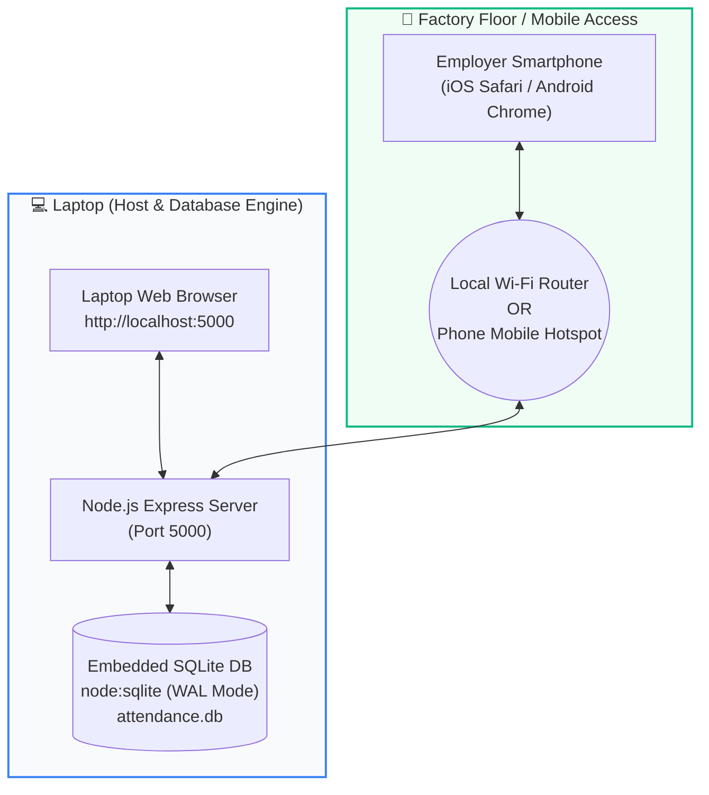

# 📦 WorkerWage — Employee Attendance & Packaging Overtime System

[](https://nodejs.org/)
[-blue.svg)](https://nodejs.org/api/sqlite.html)
[](LICENSE)
[]()
[]()

> A high-performance, mobile-accessible employee attendance, packaging production, and wage calculation system engineered for **manufacturing units, packaging workshops, and industrial sites**.
> 
> Your **laptop acts as the central server and SQLite database**, allowing the employer/admin to record daily attendance, assign work categories, track packaging overtime, and issue payouts directly from a **mobile phone** on the factory floor or from a **laptop browser**.

---

## 📑 Table of Contents

- [Why WorkerWage?](#-why-workerwage)
- [System Architecture](#-system-architecture)
- [Key Features](#-key-features)
- [Packaging Overtime & Wage Rules](#-packaging-overtime--wage-rules)
  - [Rule Matrix](#rule-matrix)
  - [Calculation Examples](#calculation-examples)
- [Weekly Off & Paid Holiday Automation](#-weekly-off--paid-holiday-automation)
- [Quick Start Guide](#-quick-start-guide)
  - [Method 1: One-Click Windows Launcher](#method-1-one-click-windows-launcher-recommended)
  - [Method 2: Command Line](#method-2-command-line)
- [How to Connect from Mobile Phone](#-how-to-connect-from-mobile-phone)
- [Workforce Roles: Worker vs. Manager](#-workforce-roles-worker-vs-manager)
- [Advances & Cash Draws Management](#-advances--cash-draws-management)
- [Payroll Reports & CSV Export](#-payroll-reports--csv-export)
- [Configuration & Settings](#-configuration--settings)
- [Project Directory Structure](#-project-directory-structure)
- [Security & Access Control](#-security--access-control)
- [Troubleshooting & FAQs](#-troubleshooting--faqs)

---

## 💡 Why WorkerWage?

Traditional attendance apps are built for corporate desk jobs with hourly check-ins. Industrial workshops, packaging units, and manufacturing plants operate under a completely different reality:

1. **Production-Driven Overtime**: Overtime is measured by **extra boxes packed**, not clock hours.
2. **Category Variations**: Workers switch packaging categories daily (e.g. `Sp 100`, `Pd 80`, `P card`, `bangles(special)`), each having specific overtime rules.
3. **Weekly Tuesday Off**: Many factory clusters observe Tuesday as their mandatory paid weekly off.
4. **Site Portability**: Employers need to mark attendance right in front of workers on the factory floor using a smartphone, without paying for expensive cloud subscriptions or depending on unreliable external internet.
5. **Data Privacy**: All payroll data, worker wages, and cash advances remain 100% private and stored on the owner's laptop.

---

## 🏛️ System Architecture



- **Zero-Dependency Native Database**: Uses Node.js's built-in `node:sqlite` (`DatabaseSync`) with Write-Ahead Logging (WAL). **No Python, node-gyp, or C++ build tools required**.
- **Local Network Discovery**: Automatically detects your Wi-Fi / Hotspot IPv4 address on startup and renders an ASCII QR code in the terminal and a clean modal in the web UI.

---

## 🌟 Key Features

- **📱 Factory Floor Mobile Access**:
  - Connect your smartphone over the same Wi-Fi or phone hotspot.
  - Scan the live QR code on screen or type the local IP address (e.g., `http://192.168.1.8:5000`).
  - Add to Home Screen (PWA) for a full-screen, native app experience.
- **📦 17 Built-In Work Categories**:
  - Pre-loaded with standard packaging categories: `Sp 100`, `Sp 80`, `Sp 80 kishanganj`, `Pd 80`, `Pd 100`, `S 50`, `Pd 40`, `Pd 50`, `P 100`, `p 95`, `P card`, `Sp card`, `pd orange card`, `pd pink card`, `pd big card`, `sp big card`, and `bangles(special)`.
  - Add or delete categories dynamically from the Settings tab.
- **⚡ 1-Tap Attendance Recording**:
  - **"⚡ Mark All Present"** records the entire workforce in a single tap.
  - Automatically changes to **"🌴 Mark All Paid Leave"** on Tuesdays and declared holidays.
  - Instant live recalculation of daily wages as adjustments are made.
- **💵 Cash Advances & Settlement Tracking**:
  - Record mid-month cash draws and loans with payment mode tagging (Cash, UPI, Bank).
  - Automatically deducted from gross earnings to maintain a live **Net Payable Liability**.
- **📊 Real-Time Payroll & Excel Export**:
  - Filter payroll by This Month, This Week, Last Month, or custom date ranges.
  - Comprehensive breakdown: base pay, packaging OT pay, holiday OT pay, advances, and net due.
  - Export full audit data directly into `.csv` for Excel and accounting software.

---

## 🧮 Packaging Overtime & Wage Rules

Wages are strictly day-based: **Full Day (1.0d base wage)**, **Half Day (0.5d base wage)**, and **Absent (0.0d)**. Overtime pay is calculated based on category rules:

### Rule Matrix

| Work Category Type | Example Categories | Normal Working Days | Paid Holidays & Tuesdays (If Worked) |
| :--- | :--- | :--- | :--- |
| **Cards (Any Type)** | `P card`, `Sp card`, `pd orange card`, `pd pink card`, `pd big card`, `sp big card` | **Disabled** (₹0 OT)<br>*(Extra inputs hidden)* | **Fixed ₹200 Overtime**<br>*(Added to full day base wage)* |
| **Bangles** | `bangles(special)` | **Disabled** (₹0 OT)<br>*(Extra inputs hidden)* | **Fixed ₹200 Overtime**<br>*(Added to full day base wage)* |
| **Standard Packaging** | `Sp 100`, `Sp 80`, `Pd 80`, `Pd 100`, `S 50`, `Pd 40`, `P 100`, etc. | **Extra Boxes $\times$ ₹30/box**<br>*(Stepper & quick chips active)* | **Extra Boxes $\times$ ₹30/box**<br>*(Same as normal days)* |
| **👔 Manager** | Any role marked as Manager | **Exempt** (₹0 OT)<br>*(Fixed daily wage)* | **Exempt** (₹0 OT)<br>*(Fixed daily wage)* |

> [!NOTE]
> The default box overtime rate is **₹30.00 per extra box**, and can be customized globally in **Settings** or overridden per worker.

### Calculation Examples

#### Scenario 1: Standard Packaging Worker on a Normal Day
- **Worker**: Amit Patel (Daily Wage: ₹500.00)
- **Work Category**: `Sp 100`
- **Extra Boxes Packed**: `3 boxes`
- **Calculation**:
  $$\text{Base Wage} = ₹500.00$$
  $$\text{OT Pay} = 3 \text{ boxes} \times ₹30.00 = ₹90.00$$
  $$\mathbf{\text{Total Day Pay}} = ₹500.00 + ₹90.00 = \mathbf{₹590.00}$$

#### Scenario 2: Card Worker on a Normal Day
- **Worker**: Ramesh Kumar (Daily Wage: ₹750.00)
- **Work Category**: `P card`
- **Calculation**: Overtime is disabled for card/bangle work on normal days.
  $$\mathbf{\text{Total Day Pay}} = \mathbf{₹750.00}$$

#### Scenario 3: Card or Bangle Worker Working on Tuesday (Weekly Off)
- **Worker**: Suresh Singh (Daily Wage: ₹700.00)
- **Day**: Tuesday (Automated Paid Weekly Off)
- **Work Category**: `bangles(special)`
- **Status**: Worked Today (+Overtime)
- **Calculation**:
  $$\text{Holiday Base Wage} = ₹700.00$$
  $$\text{Holiday Fixed OT} = ₹200.00$$
  $$\mathbf{\text{Total Day Pay}} = ₹700.00 + ₹200.00 = \mathbf{₹900.00}$$

#### Scenario 4: Standard Packaging Worker Working on Tuesday (Weekly Off)
- **Worker**: Vikram Yadav (Daily Wage: ₹750.00)
- **Day**: Tuesday (Automated Paid Weekly Off)
- **Work Category**: `Pd 80`
- **Status**: Worked Today (+Overtime), packed `4 extra boxes`
- **Calculation**:
  $$\text{Holiday Base Wage} = ₹750.00$$
  $$\text{Packaging OT} = 4 \text{ boxes} \times ₹30.00 = ₹120.00$$
  $$\mathbf{\text{Total Day Pay}} = ₹750.00 + ₹120.00 = \mathbf{₹870.00}$$

#### Scenario 5: Worker Stays Home on Tuesday (Day Off)
- **Worker**: Rajesh Sharma (Daily Wage: ₹800.00)
- **Status**: Off (Paid Full Day)
- **Calculation**: Full base day wage credited.
  $$\mathbf{\text{Total Day Pay}} = \mathbf{₹800.00} \quad (\text{OT} = ₹0.00)$$

---

## 🌴 Weekly Off & Paid Holiday Automation

WorkerWage includes an automated calendar engine for factory schedules:

1. **Tuesday Automatic Paid Day Off**:
   - The system automatically detects Tuesdays.
   - Workers default to **"Off (Paid Full Day)"** with full base wage.
   - If emergency production runs on Tuesday, switching to **"Worked Today (+Overtime)"** calculates the holiday overtime automatically.
2. **Custom Paid Holidays**:
   - Declare any date as a paid holiday (e.g., Diwali, Independence Day, Eid) under **Settings ➔ Paid Holidays**.
   - Applies the exact same paid day-off rules as Tuesdays.

---

## 🚀 Quick Start Guide

### Prerequisites
- [Node.js](https://nodejs.org/) version **22.x or higher** installed on your laptop.

### Method 1: One-Click Windows Launcher (Recommended)
Simply double-click **`Start-Server.bat`** in the project folder. This will:
1. Launch the server in a terminal window.
2. Generate the mobile connection QR code.
3. Automatically launch your default browser to `http://localhost:5000`.

### Method 2: Command Line
Open PowerShell or Terminal in the project root:
```bash
# Install dependencies
npm install

# Start the server
npm start
```

---

## 📱 How to Connect from Mobile Phone

You don't need internet on the factory floor — just a local connection between your laptop and phone:

```
┌─────────────────────────────────────────────────────────────┐
│  STEP 1: Connect to the same network                        │
│          • Connect both laptop & phone to the shop Wi-Fi    │
│          • OR turn on Phone Hotspot & connect laptop to it  │
│                                                             │
│  STEP 2: Open on Mobile                                     │
│          • Scan the QR code shown on the laptop screen      │
│          • OR open your phone browser and visit:            │
│            http://<laptop-ip-address>:5000                  │
│                                                             │
│  STEP 3: Unlock                                             │
│          • Enter Admin PIN (Default: 1234)                  │
│                                                             │
│  STEP 4: (Optional) Add to Home Screen                      │
│          • iOS Safari: Tap Share ➔ "Add to Home Screen"     │
│          • Android Chrome: Tap Menu ➔ "Add to Home screen"  │
└─────────────────────────────────────────────────────────────┘
```

---

## 👔 Workforce Roles: Worker vs. Manager

WorkerWage supports role differentiation directly in worker profiles:

| Feature | 📦 Packaging Worker | 👔 Site Manager |
| :--- | :--- | :--- |
| **Wage Structure** | Daily wage rate | Fixed daily salary |
| **Work Categories** | Selectable on each attendance card | Hidden & exempt |
| **Overtime Tracking** | Box-based (@ ₹30/box) or fixed holiday OT | Fully exempt (fixed salary) |
| **Card UI** | Production stepper, category picker, chips | Dedicated Manager badge & supervision notes |

To designate a worker as a manager:
1. Open **Workers** tab ➔ Click **Edit Worker** (or **Add Worker**).
2. Set **Worker Type** to `👔 Manager`.
3. Save changes.

---

## 💵 Advances & Cash Draws Management

Keep cash advances cleanly separated from daily wage calculations:
- Record mid-month cash advances, daily draws, or food allowances in the **Advances & Payouts** tab.
- Choose payment method: `Cash`, `UPI`, `Bank Transfer`, or `Cheque`.
- Worker's live **Net Due** automatically recalculates:
  $$\text{Net Payable} = \text{Gross Earnings} - \text{Total Advances Paid}$$

---

## 📊 Payroll Reports & CSV Export

The **Payroll & Reports** view provides a complete financial overview:
- **Grand Metrics**: Total Base Pay, Total Overtime Pay, Extra Boxes Packed, Extra Pieces, Advances Paid, and Net Liability.
- **Detailed Workers Table**: Day-by-day attendance counts, categories summary (e.g. `Sp 100 (5d), Pd 80 (2d)`), overtime breakdown, and payout action button.
- **One-Click CSV Export**: Download a spreadsheet ready for Excel, Tally, or direct bank disbursements.

---

## ⚙️ Configuration & Settings

From the **System Settings** panel (`tabSettings`):
1. **Packaging Defaults**: Configure default overtime rate per box (e.g. ₹30/box).
2. **Work Categories**: Add new custom categories or remove discontinued product lines with live counter badge.
3. **Admin Security PIN**: Update your 4-digit security PIN.
4. **Site / Business Profile**: Update business name and site location displayed on report headers.
5. **Database Backup**: Download an instant snapshot of `attendance.db` to your local drive.

---

## 📁 Project Directory Structure

```text
WorkerWage/
├── Start-Server.bat          # 1-Click launcher for Windows
├── server.js                 # Express REST API, IP discovery & QR generation
├── db.js                     # SQLite engine, table schema & migrations (node:sqlite)
├── attendance.db             # Local SQLite database file
├── package.json              # Project dependencies & scripts
├── README.md                 # Complete system documentation
└── public/                   # Mobile-first frontend client
    ├── index.html            # Main single-page interface
    ├── manifest.json         # PWA configuration for mobile home screen
    ├── css/
    │   └── style.css         # Modern responsive responsive stylesheet
    └── js/
        ├── api.js            # Central API client & formatting utilities
        ├── app.js            # App routing, PIN auth modal & QR popup
        ├── attendance.js     # Attendance cards, steppers, category switching & live formulas
        ├── employees.js      # Worker directory, rates & role management
        ├── payments.js       # Advances & cash draws management
        └── payroll.js        # Payroll ledger, grand totals & CSV generation
```

---

## 🔒 Security & Access Control

- **Admin-Only Protection**: The system is intended strictly for the business owner. Employees do not have login accounts.
- **Default PIN**: `1234` (Change immediately upon deployment under **Settings ➔ Admin Security PIN**).
- **Session Security**: PIN authentication issues a local bearer token saved in browser storage.
- **Local Network Isolation**: The server binds to local network interfaces (`localhost` and local Wi-Fi IP). It does not open public internet ports unless you intentionally configure a tunnel.

---

## ❓ Troubleshooting & FAQs

#### Q: My phone cannot connect to the server.
1. Check that both your phone and laptop are on the **exact same Wi-Fi network**.
2. If using mobile hotspot, ensure your laptop is connected to your **phone's hotspot**.
3. Check Windows Firewall: If prompted by Windows Defender on first start, click **"Allow Access"** for Node.js on private networks.

#### Q: How do I change the default overtime rate from ₹30?
Go to **Settings ➔ Packaging Overtime Defaults**, update the rate, and click **Save Packaging Defaults**.

#### Q: How do I backup my attendance records?
Go to **Settings ➔ Backup Database** and click **Download Database Snapshot**. You can also copy the `attendance.db` file from the project directory at any time.

---

## 📄 License

This project is licensed under the [MIT License](LICENSE).
Built for seamless factory & workshop administration.
