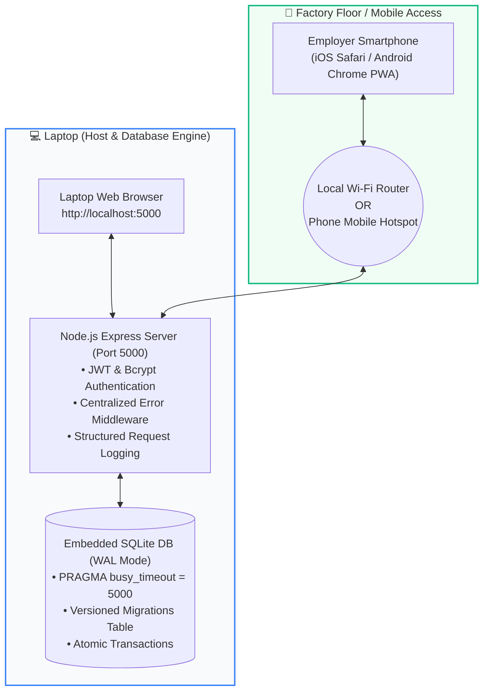
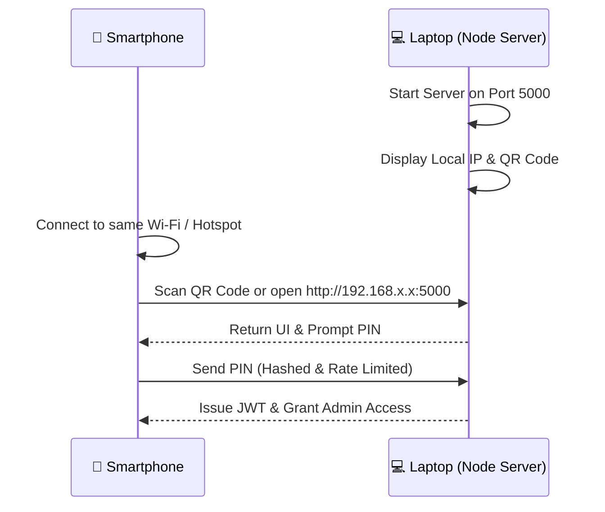

# 📦 WorkerWage — Employee Attendance & Packaging Overtime System (v2.0)

[](https://nodejs.org/)
[-blue.svg)](https://nodejs.org/api/sqlite.html)
[]()
[]()
[]()
[](LICENSE)

> A production-grade, secure, mobile-accessible employee attendance, packaging production tracking, and wage calculation system built for **manufacturing units, packaging workshops, and industrial sites**.
> 
> Your **laptop acts as the local host and SQLite database**, allowing the employer or supervisor to record attendance, manage work categories, track box-based overtime, issue cash advances, and generate payroll directly from a **mobile phone on the workshop floor** or from a **laptop web browser**.

---

## 📑 Table of Contents

- [System Architecture](#-system-architecture)
- [Key Features](#-key-features)
- [Packaging Overtime & Wage Business Rules](#-packaging-overtime--wage-business-rules)
  - [Rule Matrix](#rule-matrix)
  - [Calculation Formulas](#calculation-formulas)
- [Weekly Off (Tuesday) & Paid Holiday Automation](#-weekly-off-tuesday--paid-holiday-automation)
- [Security & Authentication Architecture](#-security--authentication-architecture)
- [Database Integrity & Concurrency (WAL Mode)](#-database-integrity--concurrency-wal-mode)
- [Quick Start Guide](#-quick-start-guide)
  - [Method 1: Windows One-Click Launcher](#method-1-windows-one-click-launcher-recommended)
  - [Method 2: Command Line](#method-2-command-line)
- [Connecting from a Smartphone (LAN / Hotspot)](#-connecting-from-a-smartphone-lan--hotspot)
- [Automated Testing & CI/CD Pipeline](#-automated-testing--cicd-pipeline)
- [Production Deployment & Backups](#-production-deployment--backups)
- [API Reference](#-api-reference)
- [Project Directory Layout](#-project-directory-layout)

---

## 🏛️ System Architecture



- **Zero-Dependency Native SQLite**: Uses Node.js's native `node:sqlite` (`DatabaseSync`) in **Write-Ahead Logging (WAL)** mode. Zero C++ compilations, zero Python dependencies, zero `node-gyp` setup required.
- **Local Network Pairing**: Automatically discovers the laptop's Wi-Fi / Hotspot IPv4 address on startup and renders an ASCII QR code in the terminal and a modal in the browser.
- **Strict Data Privacy**: All worker names, daily wages, cash advances, and payroll balances stay 100% on-premises on the owner's laptop.

---

## 🌟 Key Features

1. **📱 Factory Floor Mobile Usability**:
   - Pair any phone over the same Wi-Fi or phone hotspot.
   - Scan the on-screen QR code or open `http://<laptop-ip>:5000`.
   - Installable as a Progressive Web App (PWA) with full-screen experience and offline connectivity detection.
2. **📦 17 Pre-Configured Packaging Categories**:
   - `Sp 100`, `Sp 80`, `Sp 80 kishanganj`, `Pd 80`, `Pd 100`, `S 50`, `Pd 40`, `Pd 50`, `P 100`, `p 95`, `P card`, `Sp card`, `pd orange card`, `pd pink card`, `pd big card`, `sp big card`, `bangles(special)`.
   - Add, edit, or customize categories on the fly via Settings.
3. **⚡ 1-Tap Attendance Recording**:
   - **"⚡ Mark All Present"** marks all active workers in one click.
   - Automatically adapts to **"🌴 Mark All Paid Leave"** on Tuesdays and declared holidays.
   - Supports atomic batch attendance submissions inside database transactions.
4. **💵 Advances & Cash Draws Management**:
   - Record mid-month loans, cash advances, or salary payouts.
   - Tag with payment method (`CASH`, `UPI`, `BANK_TRANSFER`, `CHEQUE`).
   - Automatically deducted from gross earnings to maintain a live **Net Balance Payable**.
5. **📊 Real-Time Payroll & Excel CSV Export**:
   - Filter payroll reports by Month, Week, or Custom Dates.
   - Comprehensive breakdown: Base Pay, Extra Box OT, Holiday OT, Advances, and Net Due.
   - Download audit CSVs ready for Microsoft Excel and accounting spreadsheets.
6. **🔒 Hardened Admin Security**:
   - Bcrypt-hashed PIN with brute-force lockout.
   - Signed JSON Web Tokens with HTTP-only cookies and Bearer token fallback.
   - Content Security Policy (CSP), nosniff, and anti-framing headers.

---

## 📐 Packaging Overtime & Wage Business Rules

Industrial packaging units compensate workers according to specialized production rules:

### Rule Matrix

| Worker Type | Category Type | Working Condition | Base Pay | Overtime Calculation |
| :--- | :--- | :--- | :--- | :--- |
| **WORKER** | Standard Boxes (`Sp 100`, `Pd 80`, etc.) | Regular Day | Full / Half Daily Wage | **Extra Boxes $\times$ Box Rate** (Default ₹30/box) |
| **WORKER** | Cards & Bangles (`P card`, `bangles(special)`, etc.) | Regular Day | Full / Half Daily Wage | **₹0.00** (Disabled on regular days) |
| **WORKER** | Cards & Bangles (`P card`, `bangles(special)`, etc.) | Worked Tuesday or Paid Holiday | Full / Half Daily Wage | **Fixed ₹200.00** overtime pay |
| **WORKER** | Any Category | Leave on Tuesday / Holiday | Full Daily Wage (Auto-Paid) | **₹0.00** |
| **MANAGER** | Any | Regular Day or Holiday | Full / Half Daily Wage | **Exempt from box overtime**. Optional day multiplier ($otDays \times dailyWage \times multiplier$) |

### Calculation Formulas

$$\text{Base Pay} = \begin{cases} \text{Daily Wage}, & \text{status} \in \{\text{PRESENT}, \text{PAID\_LEAVE}, \text{PAID\_HOLIDAY}\} \\ 0.5 \times \text{Daily Wage}, & \text{status} = \text{HALF\_DAY} \\ 0, & \text{status} = \text{ABSENT} \end{cases}$$

$$\text{Gross Pay} = \text{Base Pay} + \text{Overtime Pay} + \text{Bonus} - \text{Deduction}$$

$$\text{Net Due} = \max(0, \text{Gross Pay} - \text{Advances Deducted})$$

---

## 🌴 Weekly Off (Tuesday) & Paid Holiday Automation

- **Tuesday Weekly Off**: Manufacturing hubs commonly observe Tuesdays as their weekly off. The system automatically detects Tuesdays and defaults unmarked workers to **PAID_LEAVE** (full day wage).
- **Custom Declared Holidays**: Add festive holidays (e.g. Diwali, Independence Day, Eid) with a single tap. Workers are automatically granted paid leave.
- **Worked Holiday Incentives**: If a worker attends on Tuesday or a Paid Holiday, their status switches to `PRESENT` and holiday overtime rules trigger automatically (fixed ₹200 for cards/bangles; box rate for boxes).

---

## 🛡️ Security & Authentication Architecture

WorkerWage v2 implements end-to-end security hardening:

1. **Bcrypt PIN Hashing**:
   - The master admin PIN is hashed using `bcryptjs` with 10 salt rounds. Plaintext PINs are never stored. Existing databases are upgraded automatically.
2. **Server-Side JWT Session**:
   - A persistent, cryptographically secure 64-character JWT secret is initialized in the database.
   - Login issues a 7-day signed JWT stored in a browser `HttpOnly`, `SameSite=Lax` cookie with Bearer authorization header fallback.
3. **Brute-Force Rate Limiting**:
   - Limits failed PIN attempts to **5 tries per minute**. Exceeding the threshold triggers an automatic **2-minute IP lockout** with HTTP 429.
4. **Protected File Downloads**:
   - The `/api/backup` SQLite download requires verified admin token authentication via cookie or signed query parameter.
5. **Input Validation & XSS Sanitization**:
   - All inputs (worker names, numbers, dates, payment types) pass through strict boundary validators and HTML entity sanitization (`&lt;`, `&gt;`, `&quot;`, `&#039;`).
6. **Security Headers**:
   - Pre-configured with `Content-Security-Policy`, `X-Content-Type-Options: nosniff`, `X-Frame-Options: SAMEORIGIN`, and `Referrer-Policy`.

---

## 💾 Database Integrity & Concurrency (WAL Mode)

WorkerWage utilizes Node 22 native `node:sqlite` configured for high concurrency:

- **Write-Ahead Logging (WAL)**: `PRAGMA journal_mode = WAL;` allows simultaneous readers while writing.
- **Synchronous Safety**: `PRAGMA synchronous = NORMAL;` ensures data durability on disk without blocking operations.
- **Busy Timeout**: `PRAGMA busy_timeout = 5000;` waits up to 5 seconds if a write lock occurs, preventing `SQLITE_BUSY` crashes during concurrent phone/laptop entries.
- **Foreign Key Constraints**: `PRAGMA foreign_keys = ON;` cascades deletions cleanly.
- **Versioned Migrations**: Every schema change is tracked idempotently in the `schema_migrations` table.
- **Atomic Multi-Statement Transactions**: Critical multi-row writes (such as batch attendance updates) are executed inside `withTransaction(...)` with automatic rollback on error.
- **System Diagnostics**: Public `GET /api/health` checks database integrity via `PRAGMA integrity_check` and reports live server status.

---

## 🚀 Quick Start Guide

### Prerequisites
- [Node.js](https://nodejs.org/) **v22.x** or higher installed on your laptop.

### Method 1: Windows One-Click Launcher (Recommended)
Double-click:
```text
start_server.bat
```
The script automatically verifies your local IP, starts the Node server, and launches your default browser at `http://localhost:5000`.

### Method 2: Command Line
```bash
# 1. Clone repository
git clone https://github.com/MSAgarwal/WorkerWage.git
cd WorkerWage

# 2. Install dependencies
npm install

# 3. Start the application
npm start
```

Default Admin PIN: **`1234`** *(Change this immediately in Settings $\rightarrow$ Security)*

---

## 📱 Connecting from a Smartphone (LAN / Hotspot)

You do **not** need an active internet connection.



1. **Connect to Same Network**:
   - Connect both laptop and phone to the same Wi-Fi network, **OR** turn on your phone's Mobile Hotspot and connect your laptop to it.
2. **Open the QR Code**:
   - In the laptop browser, click **"📱 Connect Phone"** in the top navigation bar.
3. **Scan with Phone Camera**:
   - Point your phone's camera at the QR code and tap the link.
4. **Enter Admin PIN**:
   - Unlock with your PIN and start marking attendance!

---

## 🧪 Automated Testing & CI/CD Pipeline

WorkerWage comes with a **native test suite** running via Node.js's built-in test runner (`node:test` and `node:assert`). Zero external test dependencies required.

Run the test suite:
```bash
npm test
```

### Test Suite Coverage (57 Tests, 0 Failures):
- **Wage Calculator Engine** (`tests/unit/wage-calculator.test.js`):
  - PRESENT, HALF_DAY, ABSENT, PAID_LEAVE wage formulas.
  - Cards & Bangles ₹0 normal day overtime vs. fixed ₹200 worked holiday overtime.
  - Packaging box overtime ($\text{boxes} \times \text{rate}$).
  - Manager exemptions and day-based multipliers.
  - Bonus and deduction mathematical clamping.
- **Validators & Sanitization** (`tests/unit/validators.test.js`):
  - ISO date validation (`isValidDate`) including leap year boundaries.
  - XSS HTML entity encoding (`sanitizeString`).
  - Worker, attendance, payment, holiday, and PIN change validation rules.
- **Authentication & Security** (`tests/integration/api-auth.test.js`):
  - Unauthorized 401 blocking.
  - Bcrypt PIN verification and JWT issuance.
  - Session verification and Bearer token parsing.
- **Health & Diagnostics** (`tests/integration/api-health.test.js`):
  - `GET /api/health` integrity check verification.
  - 404 structured JSON error handling for unknown endpoints.
- **Full Operational Lifecycle** (`tests/integration/api-crud.test.js`):
  - Worker creation with duplicate code 409 prevention.
  - Attendance recording with packaging box overtime computation.
  - Atomic batch attendance updates inside database transactions.
  - Advance payment recording and payroll report calculation.
  - Worker cascade deletion.

### GitHub Actions CI
Automated CI is configured in `.github/workflows/ci.yml`, running tests on Node 20.x and 22.x on every push and pull request.

---

## 🏭 Production Deployment & Backups

### Process Management with PM2
To run WorkerWage continuously in production with automatic restarts:
```bash
# Install PM2 globally
npm install -g pm2

# Start WorkerWage using ecosystem configuration
pm2 start ecosystem.config.js

# Save PM2 process list to start automatically on system reboot
pm2 save
pm2 startup
```

### Automated Database Backups
Create an atomic, integrity-verified snapshot of the SQLite database:
```bash
npm run backup
```
- Verifies `PRAGMA integrity_check` prior to backup.
- Flushes WAL journals using `PRAGMA wal_checkpoint(TRUNCATE)`.
- Uses `VACUUM INTO` to create an optimized, clean backup in `backups/`.
- Automatically retains the latest 30 backups, pruning older files.

---

## 📡 API Reference

All protected endpoints require an authenticated admin JWT cookie or `Authorization: Bearer <token>` header.

| Method | Endpoint | Access | Description |
| :--- | :--- | :--- | :--- |
| `GET` | `/api/health` | Public | System uptime, WAL mode, and database integrity check |
| `GET` | `/api/server-info` | Public | Returns local network IP, port, and QR code data URL |
| `POST` | `/api/auth/verify` | Public | Verifies admin PIN (rate limited: 5 attempts/min) |
| `GET` | `/api/auth/check` | Public | Verifies current JWT token validity |
| `POST` | `/api/auth/logout` | Public | Clears admin session cookie |
| `POST` | `/api/auth/change-pin` | Protected | Updates admin PIN (stored with bcrypt) |
| `GET` | `/api/settings` | Protected | Retrieves business settings and work categories |
| `PUT` | `/api/settings` | Protected | Updates business name, currency, and categories |
| `GET` | `/api/employees` | Protected | Lists all active/inactive workers |
| `POST` | `/api/employees` | Protected | Adds a new worker (sanitized, 409 duplicate code check) |
| `PUT` | `/api/employees/:id` | Protected | Updates worker profile, wage, or role |
| `DELETE` | `/api/employees/:id` | Protected | Soft-deactivates or hard-deletes worker |
| `GET` | `/api/attendance` | Protected | Retrieves date attendance merged with active workers |
| `POST` | `/api/attendance` | Protected | Records single worker attendance & calculates wage |
| `POST` | `/api/attendance/batch` | Protected | Atomic transaction batch attendance submission |
| `GET` | `/api/payments` | Protected | Lists advance draws and payouts filtered by worker/date |
| `POST` | `/api/payments` | Protected | Records an advance, payout, or settlement |
| `DELETE` | `/api/payments/:id` | Protected | Removes a payment entry |
| `GET` | `/api/holidays` | Protected | Lists custom declared paid holidays |
| `POST` | `/api/holidays` | Protected | Adds a declared paid holiday |
| `DELETE` | `/api/holidays/:id` | Protected | Deletes a holiday |
| `GET` | `/api/reports/payroll` | Protected | Computes payroll breakdown and net balances payable |
| `GET` | `/api/reports/export-csv` | Protected | Exports complete payroll report as `.csv` |
| `GET` | `/api/backup` | Protected | Downloads the live SQLite database file |

---

## 📁 Project Directory Layout

```text
WorkerWage/
├── .github/
│   └── workflows/
│       └── ci.yml               # GitHub Actions CI pipeline
├── backups/                     # Automated SQLite timestamped backups
├── public/                      # Static Web Frontend (HTML5 / Vanilla JS)
│   ├── css/
│   │   └── style.css            # Responsive mobile-first design styles
│   ├── js/
│   │   ├── api.js               # API client with JWT & offline resilience
│   │   ├── app.js               # Main UI controller & keypad handlers
│   │   ├── attendance.js        # Daily attendance & packaging overtime UI
│   │   ├── employees.js         # Worker management & profile controller
│   │   ├── payments.js          # Advances & settlement controller
│   │   └── payroll.js           # Payroll summary & CSV export controller
│   ├── index.html               # Single Page Application entrypoint
│   └── manifest.json            # PWA manifest for home screen installation
├── scripts/
│   └── backup.js                # Production SQLite backup & pruning script
├── tests/                       # Automated Test Suite (Native node:test)
│   ├── integration/
│   │   ├── api-auth.test.js     # Security & PIN authentication tests
│   │   ├── api-crud.test.js     # End-to-end CRUD & business flow tests
│   │   └── api-health.test.js   # Health check & diagnostic tests
│   └── unit/
│       ├── validators.test.js   # Input validation & sanitization tests
│       └── wage-calculator.test.js # Overtime & wage calculation tests
├── .env.example                 # Environment configuration template
├── .gitignore                   # Git exclusions (DBs, logs, backups, node_modules)
├── db.js                        # SQLite connection, migrations & transactions
├── ecosystem.config.js          # PM2 production configuration
├── errors.js                    # Standardized AppError classes & error middleware
├── package.json                 # Project manifest & npm scripts
├── server.js                    # Express HTTP server & API endpoints
├── start_server.bat             # Windows one-click launcher
├── validators.js                # Data validation & sanitization functions
├── wageCalculator.js            # Pure wage & overtime calculation engine
└── README.md                    # Project documentation
```

---

## 📄 License

This project is licensed under the [MIT License](LICENSE).
